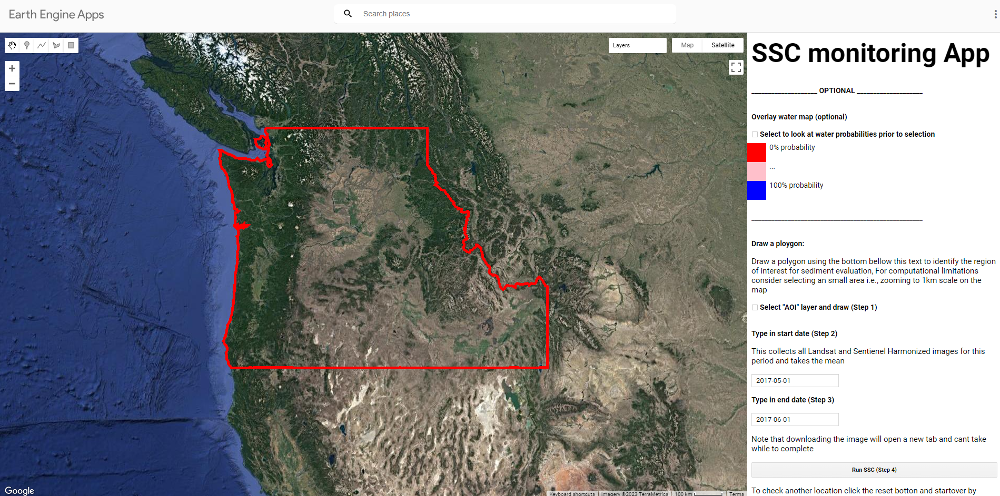
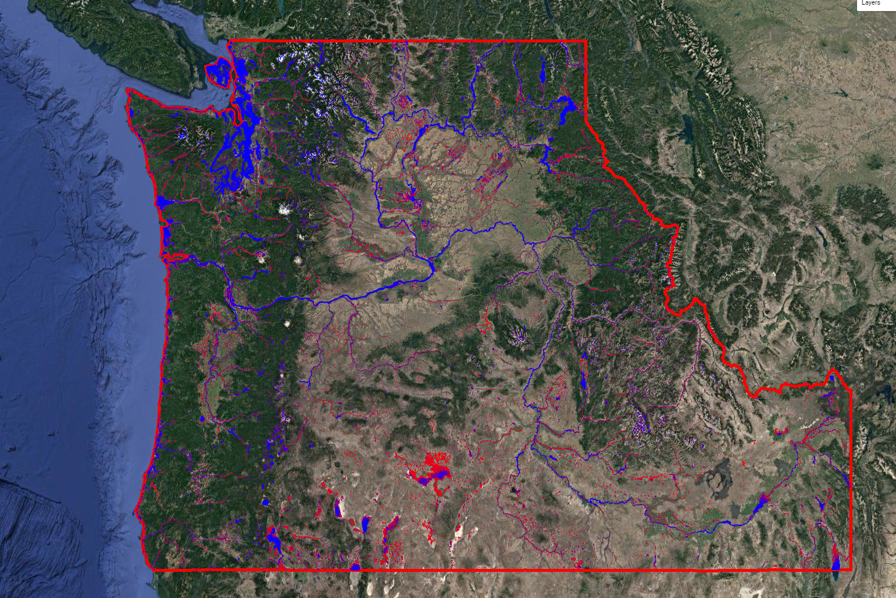
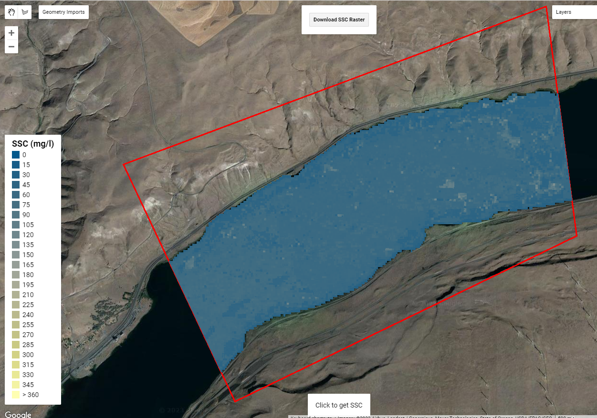

# Remote sensing of suspended sediment

- [Repo](#Repository)
  * [Cloning](#Cloning)
- [Overview](#Overview)
- [GEE App](#GEE-Application)
    * [The App](#The-App)
    * [How to](#How-to)
- [Lab exp](#Laboratory-Experiment)
    * [Model](#Model)
    * [Results](#Results)


## Repository

This repository contains a developed suspended sediment concentration (SSC) model developed for north-western US that uses Landsat and Sentinel to estimate SSC. It also contains Laboratory experiments conducted to estimate SSC in contained environment that initiated the model development for north-western US.

To ensure our code and data adhere to **FAIR** principles—making them Findable, Accessible, Interoperable, and Reusable—we are sharing them in this repository.

Users with access to the repository can add it to the Code Editor using:

https://code.earthengine.google.com/?accept_repo=users/Water_Delineation/SSC_app

The data can be separately through the following links:

https://code.earthengine.google.com/?asset=projects/arash-modaresi-rad/assets/SSC_gee

https://code.earthengine.google.com/?asset=projects/ee-earth-arash/assets/cb_2018_us_state_20m

https://code.earthengine.google.com/?asset=users/Water_Delineation/ssc_aoi


### Cloning

```shell
git clone https://github.com/arashmodrad/rs_SSC.git 
```
## Overview

Suspended sediment, encompassing particles carried in water, plays a pivotal role in shaping the dynamics of rivers, affecting their health, and influencing the functionality of man-made structures like dams. Sediment transport, a natural process, is heightened by events such as wildfires, which accelerate erosion rates and introduce large amounts of debris and ash into waterways. While some sediment is essential for healthy river ecosystems, excessive amounts, especially from wildfires or land disturbances, can have detrimental effects.

In this project we focused on north-western rivers that are heavily impacted by sediment and experience altered morphology, changing their shape and bed profile. The surplus sediment often leads to aggradation or degradation, modifying the river's overall structure and potentially impeding its flow. Additionally, excessive sediment in rivers may pose challenges to hydraulic infrastructure, affecting bridges, culverts, and other constructions by obstructing water flow and reducing channel capacity.

In summary, suspended sediment, exacerbated by events like wildfires, significantly influences river ecosystems, water quality, and the functionality of dams and man-made structures. Remote sensing of suspended sediment using satellite or airborne sensors (i.e., drones) to observe sediment-laden waters, providing large-scale insights into sediment movement and concentration in rivers, lakes, and coastal areas. It enables the monitoring of turbidity changes, spatial patterns, and sediment dynamics, aiding in water quality assessment and environmental management. This technology offers wide coverage, frequent monitoring, and the ability to detect changes post-events, supporting informed decisions for sustainable water resource management and infrastructure planning.


## GEE Application

Through our efforts, we've crafted a Google Earth Engine application specifically designed for monitoring suspended sediment. This innovative app harnesses Harmonized Landsat and Sentinel imagery for north-western US, generating a temporal coverage of suspended sediment occurring at intervals of less than five days. By leveraging this technology, users can effectively monitor and identify potential deposition hotspots. The application empowers stakeholders with an efficient and comprehensive tool to observe sediment movement and concentration in water bodies, allowing for timely and informed decision-making in environmental management and resource planning.

### The App

The SSC app is available at: https://Water_Delineation.users.earthengine.app/view/north-western-us-suspended-sediment-concentration 

<div style="display: flex; justify-content: center;">
  
</div>
<div>&nbsp;</div>

The app is limited to all rivers residing in north-western US as shown below

<div style="display: flex; justify-content: center;">
  
</div>
<div>&nbsp;</div>

The app has multiple functionalities including:

> **Visualize SSC on the fly in GEE platform**

> **Click on any pixel on map to retrieve a SSC value at that point (Click to get SSC)**

> **Download the SSC map for the selected area as .geotiff file to local computer (Download SSC Raster)**

<div style="display: flex; justify-content: center;">
  
</div>
<div>&nbsp;</div>

### How to
 
To use the application one can overlay water occurrence probability to find suitable areas for data extraction (this is optional) and the follow these steps:

1. Draw an AOI -> **Select "AOI" layer and draw (Step 1)**

<span style="color: red;">**Note:** Due to EE computational limitations it is recommended to select that AOI while in **500m scale** higher scales can result in prolonged wait times and even compute time out error</span>

2. Select a period for retrieving imagery. This involves imputing a start and an end date -> **Type in start date (Step 2, 3)**

<span style="color: red;">**Note:** if the period selected contains multiple imagery an average of them is used to make predictions</span>

3. The click on Run SSC to generate the SSC map -> **Run SSC  (Step 4)**

4. To check another location for SSC, click the reset bottom **Reset APP (Step 5)** and start over by selecting AOI form Geometry Imports and draw

## Laboratory Experiment
### Model
### Results

